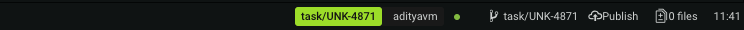
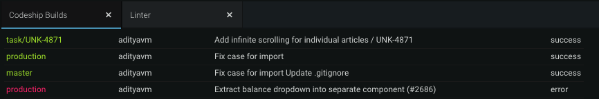

# atom-codeship-builds
Show a list of recently triggered builds with relevant information and latest status. Also adds a status-bar tile to show the latest build triggered for quick reference.




# Configuration
The package requires a `.codeshipbuilds.json` in the root folder of your project. If no config file is found, the package will not proceed. The config file should be a valid JSON with the following properties:

```javascript
{
  "username": "email@codeship.com",         // codeship login email
  "password": "your-codeship-password",     // codeship login password
  "organisation": "your-organisation-uuid", // (optional) organisation's uuid
  "project": "your-project-uuid",           // project to monitor's uuid
  "filterByUser": "adityavm",               // (optional) only show builds by this user in status-bar
  "updateInterval": 15000                   // how often the list is updated
}
```

NOTES:
* If you don't include the organisation UUID, the first one in your list of organisations will be picked. This is handy when you only have one organisation.
* Your project UUID can be found under "Project Settings".
* Skipping `filterByUser` will show the most recent build (regardless of user).

REMEMBER: This file shouldn't be committed with your code due to sensitive information.
